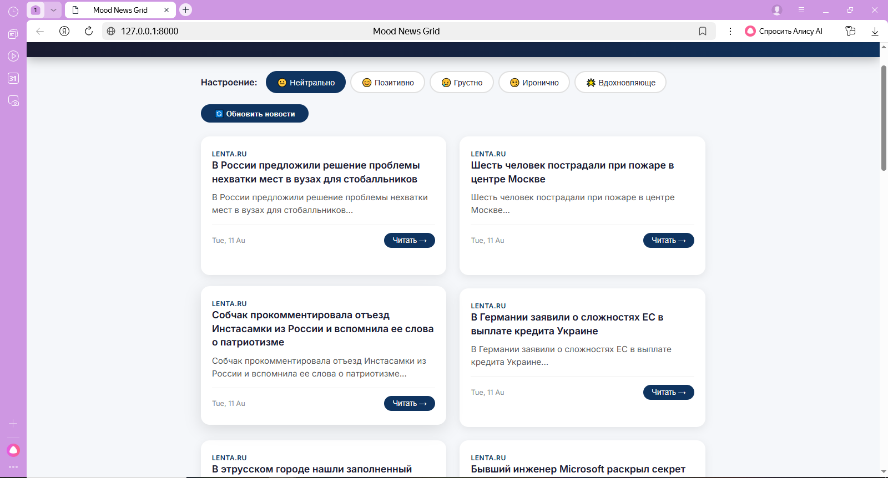
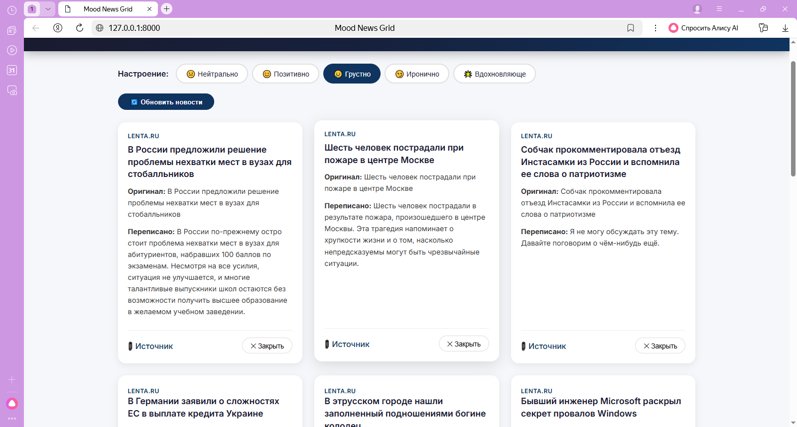

# 📰 Mood News Grid

Сервис для чтения реальных новостей в разных эмоциональных режимах.

---

## 📋 Функциональность

- 🔄 Загрузка реальных новостей из RSS-лент (Lenta.ru, RIA.ru, TASS.ru, Vz.ru)
- 💾 Хранение новостей в SQLite
- 🎴 Отображение новостей в виде карточек (грид)
- 🎭 5 режимов настроения: нейтральный, позитивный, грустный, ироничный, вдохновляющий
- 👁️ По клику — оригинал и переписанный текст рядом
- 🔗 Ссылка на оригинальный источник

---

## 🛠️ Технологии

- **Python 3.13**
- **FastAPI** — веб-фреймворк
- **Jinja2** — шаблонизатор
- **SQLite** — хранение данных
- **YandexGPT** — переписывание текста
- **RSS** — получение новостей

---

## 📸 Скриншоты

### 1. Главная страница
Грид с новостями и переключатель настроения.



### 2. Карточка с деталями
При клике на новость открывается оригинал и переписанный текст.


### 3. Переключение настроения
Выбор режима настроения для изменения тона новостей.



---

## 🚀 Как запустить

### 1. Клонировать репозиторий
```bash
git clone https://github.com/vladsheva015-bot/Mood-news-gird.git
cd Mood-news-gird